# Tên bài toán: Quản lý gửi xe cho Trường Đại Học 
- Tác giả: **Phạm Quang Trường**
- MSV: **K215480106129**
- Lớp: **K57KMT**
---
**1. Mô tả bài toán**
-  Quản lý gửi xe cho một trường đại học.
-  Hệ thống này phải lưu trữ thông tin về sinh viên, các phương tiện của họ, và các giao dịch gửi và lấy xe. 
-  Theo dõi việc gửi và lấy xe, tính phí gửi xe dựa trên loại vé (ngày hoặc tháng) và tự động gia hạn vé khi cần thiết.

**2. Các chức năng**
-   Quét xe vào: 
    -   Khi xe vào bãi, hệ thống ghi nhận thời gian vào và tạo ra giao dịch mới. Mã giao dịch sẽ được lấy ra và đưa cho sinh viên cầm.
-   Quét xe ra: 
    -   Khi xe ra khỏi nhà gửi xe, hệ thống sẽ ghi nhnj thời gian ra và tính phí gửi xe.
    -   Nếu vé ngày hoặc vé tháng vẫn còn hạn thì sẽ không cần phải trả phí.
    -   Nếu vé ngày hết hạn, hệ thống sẽ tự động đăng ký vé ngày mới cho sinh viên và tính phí dựa trên số ngày gửi.
    -   Nếu vé tháng hết hạn, hệ thống sẽ tự động gia hạn thêm một tháng nữa. Trong trường hợp sinh viên không muốn gia hạn vé tháng thì có dùng SP để đăng ký vé ngày cho sinh viên bằng ngày cuối cùng hạn vé tháng rồi sử dụng lại lại chức năng để tính phí cho sinh viên.
-   Tính doanh thu theo tháng:
    -   Tính tổng phí gửi xe trong một tháng cụ thể mà người quản lý đưa vào.
-   Xuất hoá đơn tính tiền cho sinh viên:
    -   Xuất hoá đơn có đầy đủ thông tin cần thiết cho sinh viên để thu tiền.
-   Đăng ký loại và thời gian đăng ký vé:
    -   Thay đổi thông tin loại vé và thời gian đăng ký vé xe cho sinh viên.
-   Danh sách xe đang trong bãi đỗ.
    -   Hiển thị danh sách xe đang được gửi trong bãi đỗ.

**3. Báo cáo**
Hệ thống sẽ cung cấp các báo cáo chi tiết giúp nhà quản lý theo dõi tình trạng gửi xe, doanh thu, và tình trạng vé của sinh viên. Các báo cáo này hỗ trợ việc quản lý hiệu quả và đưa ra các quyết định dựa trên dữ liệu thực tế.
-   Báo cáo doanh thu: 
    -   Hiển thị tổng số tiền thu được trong một tháng cụ thể mà người quản lý muốn.
-   Báo cáo xe đang có trong nhà xe:
    -   Danh sách xe hiện đang trong bãi: Các xe chưa quét ra, bao gồm thông tin sinh viên, biển số xe, loại xe, và thời gian vào bãi. Sử dụng thủ tục DSXDG để tạo báo cáo này.
-   Báo cáo chi tiết giao dịch:
    -   Chi tiết từng mã giao dịch: Bao gồm thời gian vào, thời gian ra, mã sinh viên, mã xe, và phí gửi xe.

**4. Các bảng trong hệ thống**
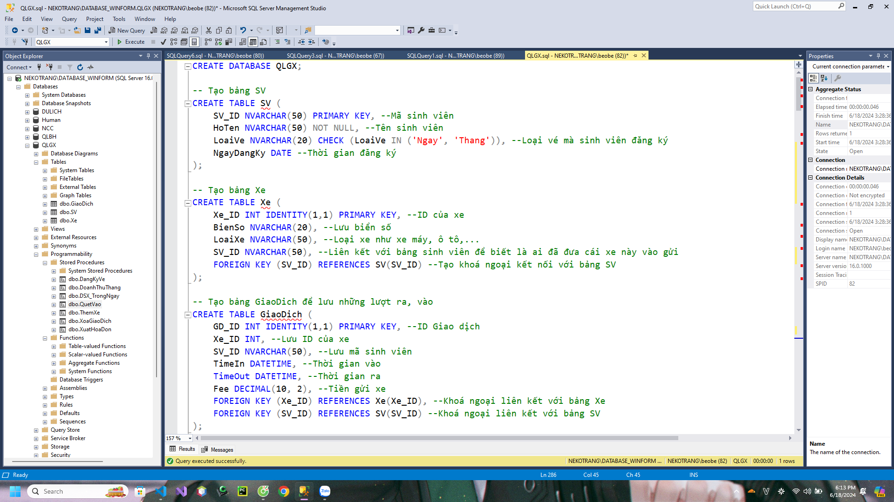

-   Bảng **SV**:
    -   #SV_ID (nvarchar(50)): Khoá chính, mỗi sinh viên chỉ có một mã duy nhất.
    -   HoTen (nvarchar(50)): Họ và tên của sinh viên.
    -   LoaiVe (nvarchar(20)): Loại vé của sinh viên và chỉ nhận giá trị "Ngay" hoặc "Thang".
    -   NgayDangKy (Date): Ngày đăng ký vé xe.
-   Bảng **Xe**:
    -   #Xe_ID (int, identity): Khoá chính, mã xe duy nhất.
    -   BienSo (nvarchar(20)): Lưu biển số xe.
    -   LoaiXe (nvarchar(50)): Lưu loại phương tiện được gửi.
    -   @SV_ID (nvarchar(50)): Khoá ngoại liên kết với bảng **SV**,  để xem sinh viên nào đã gửi xe này vào nhà xe.
-   Bảng **GiaoDich**:
    -   #GD_ID (int, identity): Khoá chính, sẽ là mã để gửi cho sinh viên, khi lấy xe thì chỉ cần mã để lấy xe và tính tiền.
    -   @Xe_ID (int): Khoá ngoại liên kết với bảng **Xe**.
    -   @SV_ID (nvarchar(50)): Khoá ngoại liên kết với bảng **SV**.
    -   TimeIn (DateTime): Lưu thời gian vào nhà xe. Cần sự chính xác về giờ phải dùng kiểu DateTime.
    -   TimeOut (DateTime): Lưu thời gian ra khỏi nhà xe. Cần sự chính xác về giờ phải dùng kiểu DateTime.
    -   Fee (decimal(10,2)): Dùng SP tính tiền rồi lưu vào đây.

**5. Các Store Procudere**
Trong hệ thống quản lý gửi xe cho trường đại học, các thủ tục lưu trữ (Stored Procedures - SP) được sử dụng để thực hiện các tác vụ quan trọng như quản lý giao dịch gửi và lấy xe, tính toán doanh thu, cập nhật thông tin sinh viên, và quản lý xe. Dưới đây là mô tả chi tiết về các thủ tục lưu trữ đã tạo:
-   SP **QuetVao**: Quét xe vào.
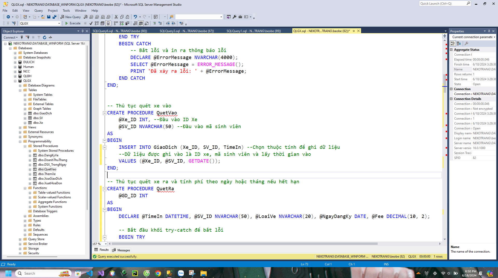
    -   Tham số đầu vào: "@Xe_ID"-ID của xe, "@SV_ID"-Mã sinh viên.
    -   Đầu ra: Tạo một giao dịch mới hay có nghĩa là đã có một xe đã vào nhà xe.
    -   Thông tin được thêm đó là mã sinh viên, mã xe, thời gian tạo giao dịch đó cũng chính là thời gian xe vào nhà xe.

-   SP **QuetRa**: Quét xe ra, tính tiền.
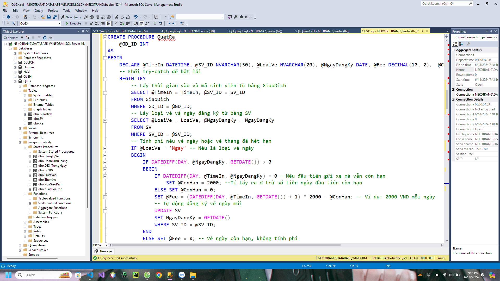
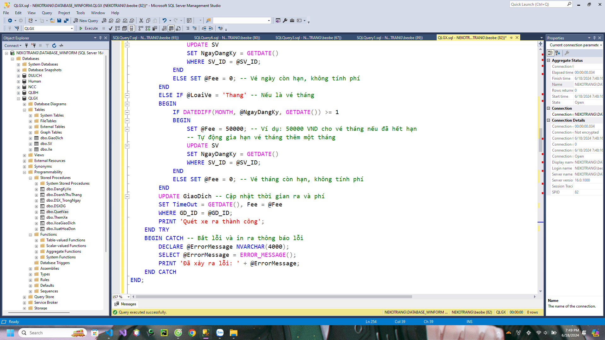
    -   Tham số đầu vào: "@GD_ID" - Mã giao dịch.
    -   Các bước thự hiện:
        -   Lấy thời gian vào và mã sinh viên từ bảng "GiaoDich".
        -   Lấy loại vé và ngày đăng ký từ bảng sinh viên.
        -   Nếu là vé ngày:
            -   Nếu khoảng cách giữa ngày đăng ký vé và ngày hiện tại lớn hơn hoặc bằng 1: 
                -   Trường hợp 1: Ngày đầu tiên còn hạn thì tính tiền rồi từ đi ngày đầu tiên.
                -   Trường hợp 2: Tính tiền bình thường bằng cách tính khoảng cách giữa ngày vào và ngày ra rồi nhân với 2000.
            -   Nếu vé còn hạn thì tiền phải trả = 0.
            -   Tự động ra hạn vé ngày hôm đó vào bảng **SV**.
        -   Nếu là vé tháng:
            -   Nếu còn hạn thì số tiền phải trả là 0.
            -   Nếu hết hạn thì sẽ tự động gia hạn và số tiền phải trả là 50000.
        -   Nếu thành công thì thông báo ra màn hình báo thành công, nếu không thì hiển thị lỗi.
-   SP **DangKyVe**: Đăng ký vé xe cho sinh viên.
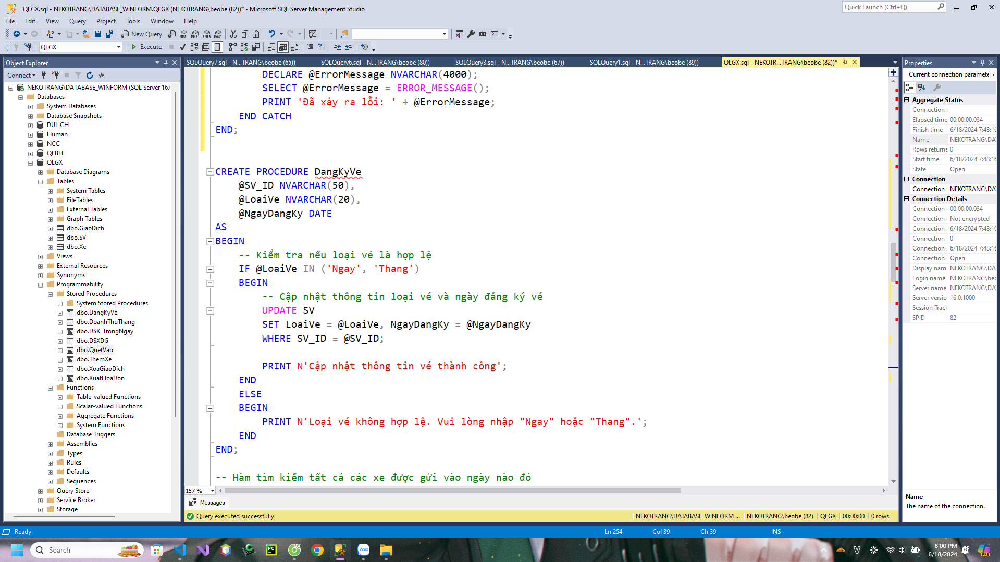
    -   Tham số đầu vào: "@SV_ID" - Mã sinh viên; "@LoaiVe" - Loại vé; "@NgayDangKy" - ngày đăng ký.
    -   Kết quả: Cập nhập thông tin về loại vé cho sinh viên.
    -   Các bước thực hiện:
        -   Đưa các tham số đầu vào là mã sinh viên, loại vé và ngày đăng ký.
        -   Trường hợp nhập đúng thông tin: Cập nhật thông tin đầu vào vào bảng **SV**.
        -   Trường hợp nhập sai: Báo nhập sai.
-   SP **ThemXe**: Thêm thông tin và bảng xe.
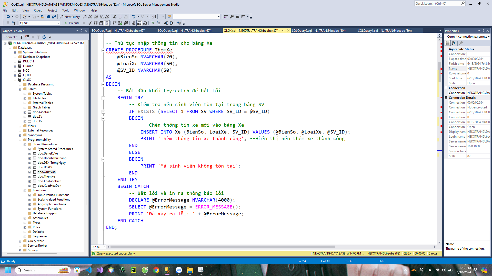
    -   Tham số đầu vào: "@BienSo" - Biển số xe; "@LoaiXe" - Loại xe; "@SV_ID" - Mã sinh viên.
    -   Kết quả: Cập nhật thông tin vé.
    -   Các bước thực hiện: 
        -   Đưa các tham số đầu vào.
        -   Sửa dụng lệnh Insert để tạo ra một Xe mới.
        -   Nếu nhập sai mã sinh viên thì sẽ đưa ra thông tin lỗi.
-   SP **DSX_TrongNgay**;
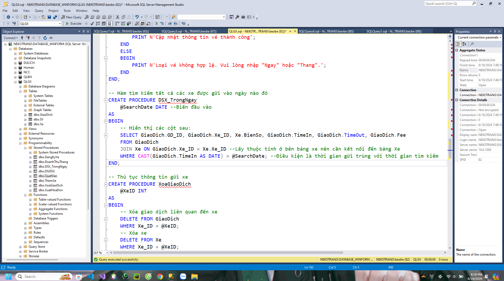
    -   Tham số đầu vào: "@SearchDate" - Ngày tuỳ chọn.
    -   Kết quả: Danh sách xe được gửi trong ngày đó.
    -   Các bước thực hiện:
        -   Đưa tham đâu vào.
        -   Dùng bảng **GiaoDich** và sử dụng khoá ngoại gọi bảng **Xe**.
        -   Hiển thị các cột thông tin.
        -   Hiển thị tất cả các giao dịch có thời gian vào nhà xe (TimeIn) bằng với ngày đầu vào.
-   SP **DSXDG**: Hiển thị danh sách xe đang được gửi trong nhà xe.
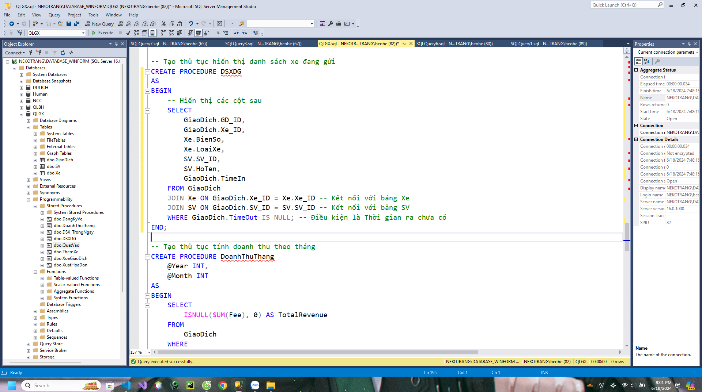
    -   Kết quả: Danh sách xe đang được gửi trong nhà xe.
    -   Các bước thực hiện:
        -   Dùng bảng "GiaoDich" và sử dụng khoá ngoại để lấy thông tin từ 2 bảng **SV** và **Xe**.
        -   Hiển thị những thông tin cần thiết.
        -   Điều kiện để hiển thị là có "TimeOut" chưa có (Null).
-   SP **XuatHoaDon**: Xuất hoá đơn đưa cho sinh viên để lấy tiền.
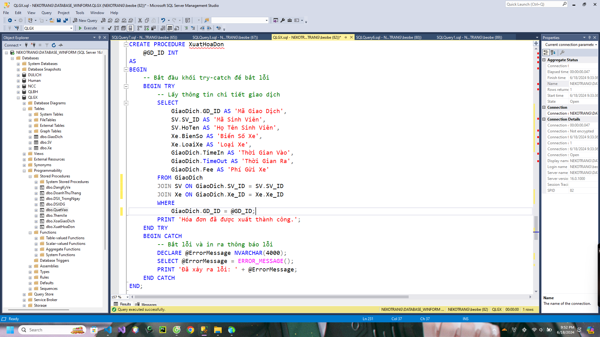
    -   Tham số đầu vào: "@GD_ID" - Mã giao dịch.
    -   Kết quả: Các thông tin cần thiết để xuất ra hoá đơn.
    -   Các bước thực hiện:
        -   Đưa tham số đầu vào.
        -   Dùng bảng **GiaoDich** và dùng khoá ngoại liên kết với các bảng **SV** và **Xe**.
        -   Chọn những thông tin cần thiết để xuất ra.
        -   Điều kiện là mã giao dịch phải trùng với mã giao dịch đầu vào.
-   SP **DoanhThuThang**: Hiển thị doanh thu của một tháng mà người quản lý muốn.
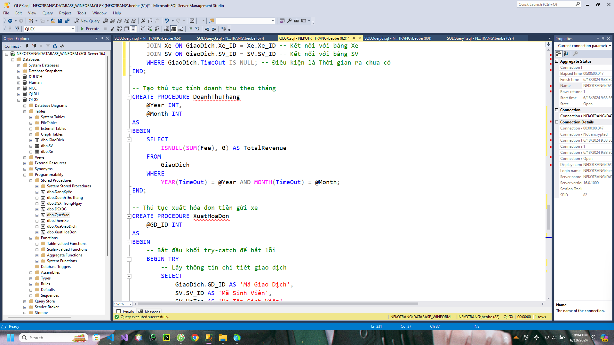
    -   Tham số đầu vào: "@Month" - Tháng; "@Year" - Năm.
    -   Đầu ra: Doanh thu của tháng đó.
    -   Các bước thực hiện:
        -   Đưa tham số đầu vào.
        -   Tính tổng tiền các giao dịch có thời gian ra trùng với tháng và năm đầu vào.
        -   Nếu xe vẫn đang được gửi thì thời gian là null thì mặc định sẽ là 0.
        -   Hiển thị doanh thu.

**6. Quá trình làm bài.**
6.1. Chức năng quét xe vào:
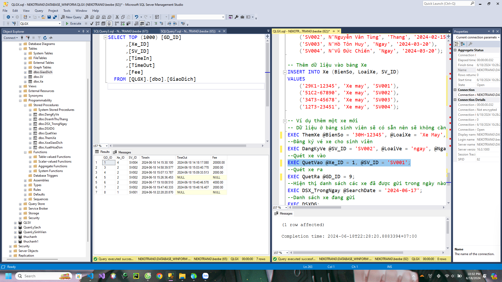
-   Sau khi nhập đủ thông tin của xe, chỉ cần lấy ID xe vừa được tạo và mã sinh viên đưa vào SP để tạo một giao dịch mới.

6.2. Chức năng quét xe ra.
-   Tạm thời thay đổi ngày gửi xe từ 18 xuống 17 để tạo khoảng cách dài hơn về ngày.
-   Giả định trường hợp vé vẫn còn hạn hôm 17 mà đến 18 mới lấy xe thì sẽ chỉ phải trả 2000.
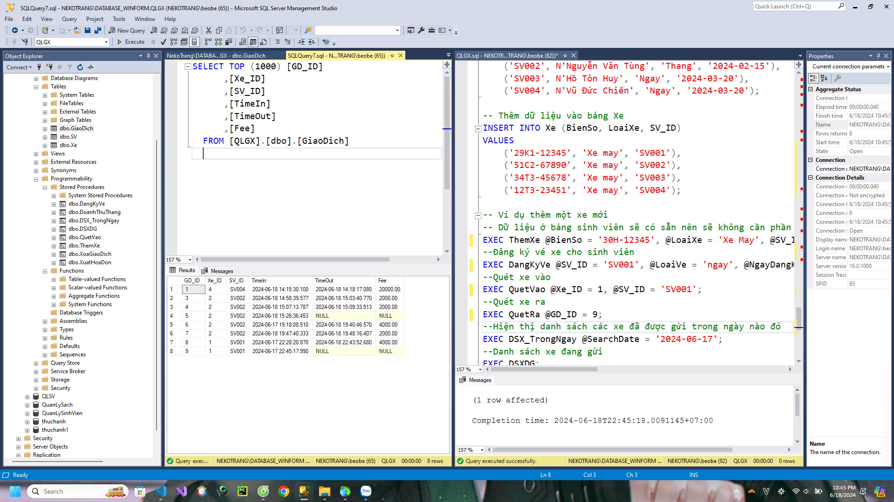
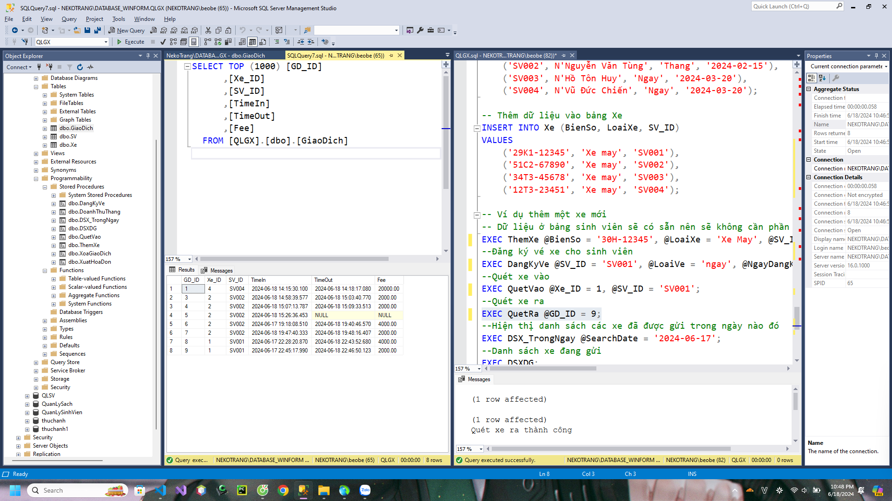
-   Sau khi chạy SP quét ra với ID giao dịch là 9 thì tiền phải trả là 2000 và cập nhật thông loại vé cho SV001.
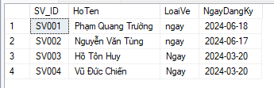
-   Với trường hợp vé còn hạn thì tiền gửi xe sẽ là 0.
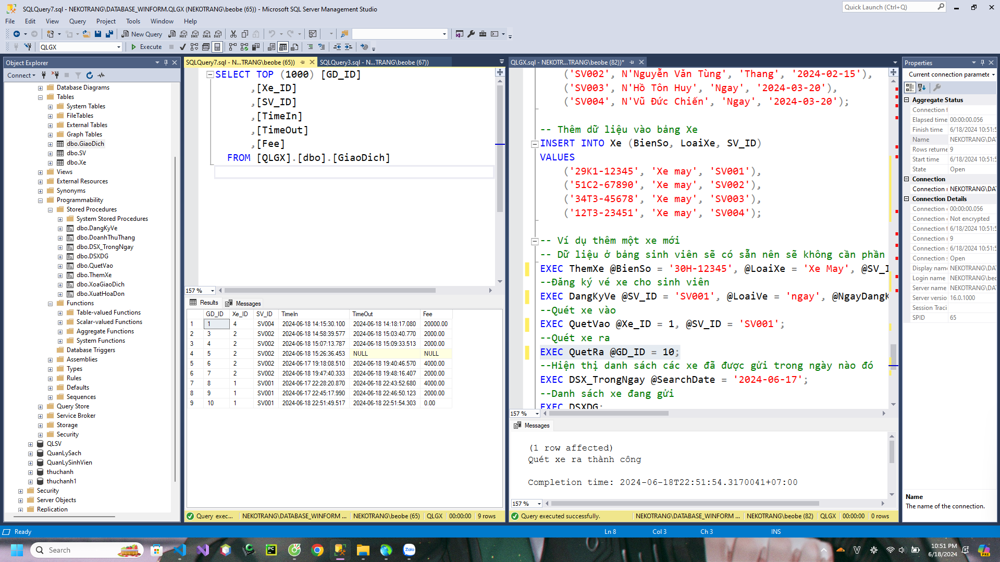

6.3. Chức năng hiển thị doanh sách xe đang có trong nhà xe.
-   Ví dụ có 2 xe đang được gửi trong nhà xe của SV002 và SV003 thì sẽ hiển thị danh sách xe không có thời gian ra.
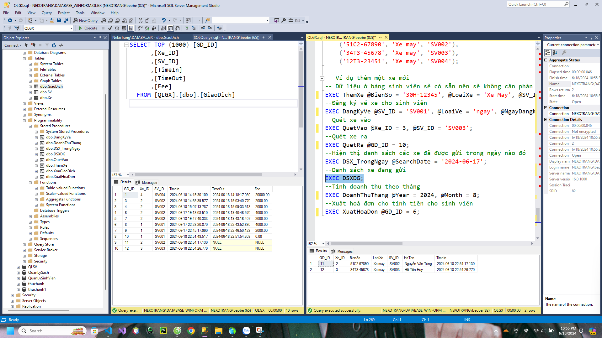

6.4. Tính doanh thu theo tháng.
-   Chọn tháng 6/2024 làm tham số đầu vào. SP sẽ tính tổng doanh thu của tất cả xe được được gửi trong tháng 6 năm 2024. Tìm tất cả các xe có thời gian ra trùng tháng và năm của tham số đầu vào.
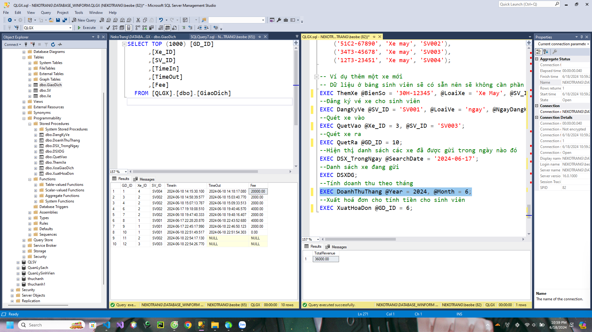

6.5. Xuất hoá đơn cho giao dịch bất kỳ.
-   Ví dụ sẽ xuất hoá đơn của giao dịch có ID là 10 thì xuất ra các thông tin cần thiết để thu tiền.
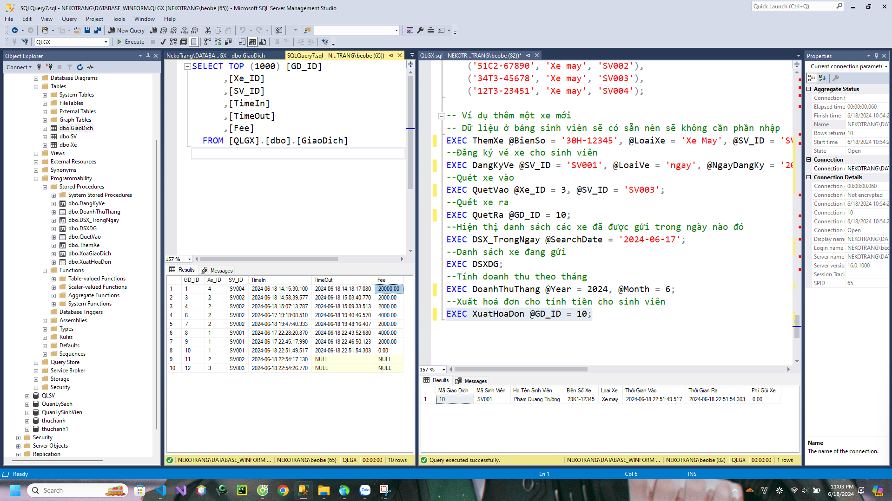

6.6. Đăng ký vé xe cho sinh viên.
-   Đăng ký cho sinh viên là loại vé tháng, ngày đăng ký 2024-06-18 cho sinh viên mã là SV004. Sẽ được kêt quả như sau:
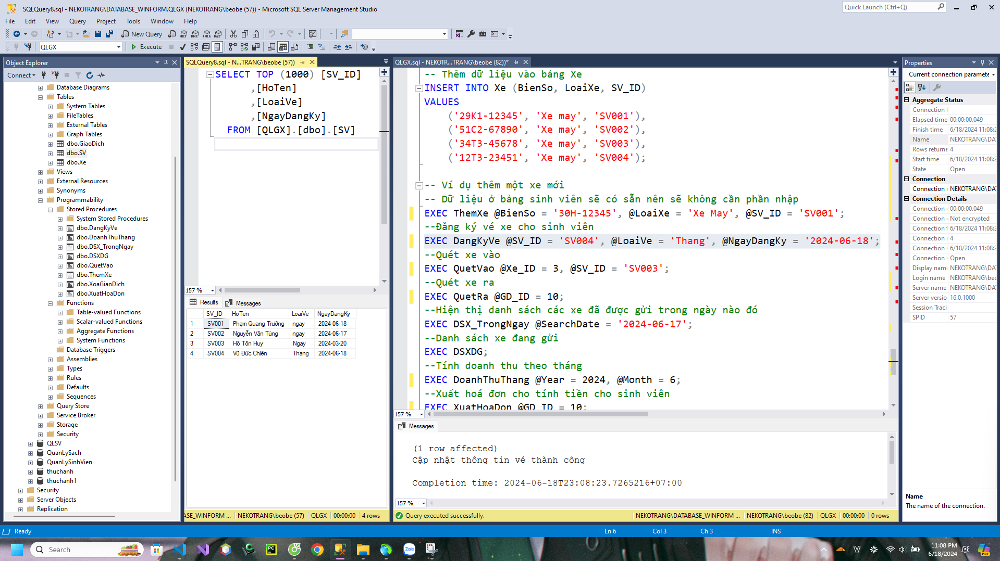
---
# Cảm ơn thầy Cốp với những bài giảng tâm huyết của thầy ạ.
.png)